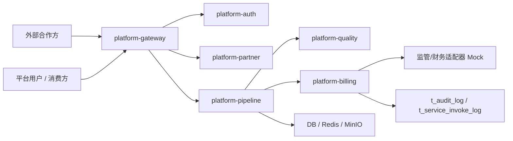

# 系统架构文档

版本：0.1.0  
日期：2026-06-26  
维护者：Codex

## 总体架构

## 模块职责

| 模块 | 职责 |
|---|---|
| `platform-common` | 统一响应、异常、审计、脱敏、SM4、安全工具、共享模型 `ServiceInvokeLog` |
| `platform-gateway` | 路由、JWT 透传、CORS、Sentinel 限流入口 |
| `platform-auth` | 登录、Token、用户角色权限、RBAC 基础 |
| `platform-partner` | 合作方与消费方生命周期、接口凭证、配额 |
| `platform-pipeline` | 多协议接入、格式转换、数据服务、目录、缓存/存储/ETL |
| `platform-quality` | 六维质量规则、校验执行、问题闭环、评分 |
| `platform-billing` | 计费规则、账单、统计、监管报表、XXL-Job 入口 |
| `platform-ui` | Vue3 管理控制台与监控大屏 |

## 技术选型

| 类别 | 技术 |
|---|---|
| 后端 | Java 17, Spring Boot 3.2.5, Spring Cloud 2023.0.1 |
| 微服务治理 | Spring Cloud Alibaba, Nacos, Sentinel |
| 数据访问 | MyBatis-Plus, H2(MySQL mode) 开发验证, 达梦/OceanBase profile |
| 缓存/消息 | Redis, Kafka, RabbitMQ |
| 调度 | XXL-Job `xxl-job-core:2.4.1` |
| 前端 | Vue3, Vite, Pinia, Element Plus, ECharts |
| 部署 | Docker, `k8s/dev` 双活模拟 |

## 数据流

1. 合作方在 `platform-partner` 注册并配置接口凭证。
2. `platform-pipeline` 通过 `ProtocolAdapter` 拉取数据，经 `FormatConverter` 标准化。
3. `platform-quality` 执行完整性、准确性、一致性、及时性、有效性、唯一性校验。
4. 原始数据进入 `t_raw_data`，服务发布配置进入 `t_data_service`。
5. 消费方通过网关调用服务，调用日志写入 `t_service_invoke_log`。
6. `platform-billing` 聚合调用日志生成账单、统计快照和监管报表。
7. `AuditLogAspect` 记录操作审计到 `t_audit_log`。

## 双活拓扑

`k8s/dev/deployment-platform-a.yaml` 与 `deployment-platform-b.yaml` 表示同城双活两个机房实例，`service.yaml` 统一暴露入口。M6 演练脚本位于 `delivery/chaos-drill/`，真实 RPO/RTO 待上线环境执行。
