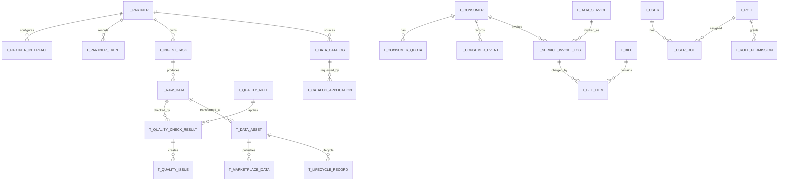

# 外部数据采集平台数据库设计文档

> 来源：`附件三 1.外部数据采集平台软件招采需求说明书.docx`、`docs/requirements.md`、`tasks/claude-plan.md`、`db/migration/*.sql`。  
> 目标：定义外部数据采集平台的逻辑数据模型、主题域、表结构、关系、索引、分区、审计、安全和国产数据库兼容设计。  
> 说明：本文是目标数据库设计。当前迁移脚本中存在少量命名/方言差异，已在“落地校验清单”列出。

## 1. 设计原则

1. 事实源清晰：合作方、接入任务、服务调用、消费方、质量结果、账单、审计分别有明确事实源。
2. 全链路可追溯：核心表保留业务编码、状态、时间、操作者和事件记录。
3. 配置与事实分离：规则、策略、权限是配置；调用、校验、账单、审计是事实。
4. 高并发写入友好：调用日志、审计日志、统计快照按时间索引和分区。
5. 敏感数据最小化：密钥、请求参数、响应摘要、个人敏感字段必须加密或脱敏。
6. 国产库兼容：标准 SQL 优先，避免 MySQL 专有语法进入生产迁移；达梦/OceanBase 方言隔离。
7. 可回滚：每个版本迁移应有对应 rollback 脚本。

## 2. 主题域模型

| 主题域 | 核心表 | 说明 |
|---|---|---|
| 身份权限 | t_user、t_role、t_permission、t_user_role、t_user_permission、t_role_permission | 管理端用户、角色、权限码 |
| 合作方 | t_partner、t_partner_interface、t_partner_event | 外部数据来源和接口 |
| 接入 | t_ingest_task、t_raw_data | 接入任务和原始数据 |
| 消费方 | t_consumer、t_consumer_quota、t_consumer_event | 内部调用方治理 |
| 数据服务 | t_data_service、t_service_invoke_log、t_api_credential | 服务发布、调用日志、API Key |
| 数据目录 | t_data_catalog、t_catalog_application | 数据资产元信息和申请审批 |
| 质量 | t_quality_rule、t_quality_check_result、t_quality_issue、t_quality_weight | 规则、校验、问题、评分 |
| 存储复用 | t_storage_policy、t_data_asset、t_marketplace_data、t_lifecycle_record | 缓存分层、加工资产、集市、生命周期 |
| 计费 | t_billing_rule、t_bill、t_bill_item | 计费规则、账单、明细 |
| 统计审计 | t_stats_snapshot、t_audit_log | 指标快照、审计追溯 |

## 3. 概念 ER 关系

## 4. 表设计总览

| 表名 | 主题域 | 数据性质 | 增长特征 | 建议分区 |
|---|---|---|---|---|
| t_user | 身份权限 | 配置 | 低 | 无 |
| t_role | 身份权限 | 配置 | 低 | 无 |
| t_permission | 身份权限 | 字典 | 低 | 无 |
| t_user_role | 身份权限 | 关系 | 低 | 无 |
| t_user_permission | 身份权限 | 关系 | 低 | 无 |
| t_role_permission | 身份权限 | 关系 | 低 | 无 |
| t_partner | 合作方 | 主数据 | 低 | 无 |
| t_partner_interface | 合作方 | 配置 | 中 | 无 |
| t_partner_event | 合作方 | 事件 | 中 | 按月可选 |
| t_ingest_task | 接入 | 配置/流程 | 中 | 无 |
| t_raw_data | 接入 | 事实数据 | 高 | 按月/日 + task_id |
| t_consumer | 消费方 | 主数据 | 中 | 无 |
| t_consumer_quota | 消费方 | 配置/计数 | 中 | 无 |
| t_consumer_event | 消费方 | 事件 | 中 | 按月可选 |
| t_data_service | 服务 | 主数据 | 中 | 无 |
| t_service_invoke_log | 服务 | 高频事实 | 极高 | 按日 |
| t_api_credential | 服务 | 凭证配置 | 中 | 无 |
| t_data_catalog | 目录 | 元数据 | 中 | 无 |
| t_catalog_application | 目录 | 流程 | 中 | 按月可选 |
| t_quality_rule | 质量 | 配置 | 中 | 无 |
| t_quality_check_result | 质量 | 事实 | 高 | 按月/批次 |
| t_quality_issue | 质量 | 工单 | 中 | 按月可选 |
| t_quality_weight | 质量 | 配置 | 低 | 无 |
| t_storage_policy | 存储 | 配置 | 低 | 无 |
| t_data_asset | 存储 | 资产 | 高 | 按创建时间/主题 |
| t_marketplace_data | 存储 | 资产发布 | 中 | 无 |
| t_lifecycle_record | 存储 | 事件 | 高 | 按月 |
| t_billing_rule | 计费 | 配置 | 中 | 无 |
| t_bill | 计费 | 事实 | 中 | 按账期 |
| t_bill_item | 计费 | 明细事实 | 高 | 按账期 |
| t_stats_snapshot | 统计 | 指标事实 | 高 | 按时间 |
| t_audit_log | 审计 | 合规事实 | 极高 | 按月/日 |

## 5. 表字典

### 5.1 身份权限域

#### t_user

| 字段 | 类型 | 约束 | 说明 |
|---|---|---|---|
| id | BIGINT | PK | 用户 ID |
| username | VARCHAR(64) | UNIQUE NOT NULL | 登录名 |
| password_hash | VARCHAR(128) | NOT NULL | BCrypt 后密码摘要 |
| status | VARCHAR(32) | NOT NULL，建议默认 ACTIVE | 状态 |
| created_at | TIMESTAMP | NOT NULL | 创建时间 |
| updated_at | TIMESTAMP |  | 更新时间 |

索引：

- uk_user_username(username)

#### t_role

| 字段 | 类型 | 约束 | 说明 |
|---|---|---|---|
| id | BIGINT | PK | 角色 ID |
| code | VARCHAR(64) | UNIQUE | 角色编码 |
| name | VARCHAR(128) | NOT NULL | 角色名称 |
| created_at | TIMESTAMP |  | 创建时间 |

#### t_permission

| 字段 | 类型 | 约束 | 说明 |
|---|---|---|---|
| id | BIGINT | PK | 权限 ID |
| code | VARCHAR(128) | UNIQUE NOT NULL | 权限码，如 partner:view |
| name | VARCHAR(128) | NOT NULL | 权限名称 |

#### t_user_role

| 字段 | 类型 | 约束 | 说明 |
|---|---|---|---|
| id | BIGINT | PK | 主键 |
| user_id | BIGINT | FK | 用户 |
| role_id | BIGINT | FK | 角色 |

唯一索引：

- uk_user_role(user_id, role_id)

#### t_user_permission / t_role_permission

用于直接授予用户或角色权限码。建议权限码引用 t_permission.code，但国产库跨字段外键兼容复杂时可由应用层校验。

### 5.2 合作方域

#### t_partner

| 字段 | 类型 | 约束 | 说明 |
|---|---|---|---|
| id | BIGINT | PK | 合作方 ID |
| partner_code | VARCHAR(64) | UNIQUE NOT NULL | 合作方编码 |
| name | VARCHAR(128) | NOT NULL | 名称 |
| data_type | VARCHAR(64) |  | 数据类型 |
| industry_type | VARCHAR(64) |  | 行业属性 |
| compliance_level | VARCHAR(32) |  | 合规等级 |
| service_quality_level | VARCHAR(32) |  | 服务质量等级 |
| status | VARCHAR(32) | NOT NULL | 生命周期状态 |
| rating | VARCHAR(8) |  | A/B/C/D |
| created_at | TIMESTAMP | NOT NULL | 创建时间 |
| updated_at | TIMESTAMP |  | 更新时间 |

索引：

- uk_partner_code(partner_code)
- idx_partner_status(status)
- idx_partner_class(data_type, industry_type, compliance_level)

#### t_partner_interface

| 字段 | 类型 | 约束 | 说明 |
|---|---|---|---|
| id | BIGINT | PK | 接口 ID |
| partner_id | BIGINT | NOT NULL | 合作方 ID |
| protocol | VARCHAR(32) | NOT NULL | HTTP/WS/SFTP/KAFKA/MQ/DB/API_GATEWAY |
| endpoint | VARCHAR(512) | NOT NULL | 接口地址或资源定位 |
| data_scope | VARCHAR(512) |  | 数据范围 |
| rate_limit_per_minute | BIGINT |  | 合作方接口频控 |
| credential_cipher | VARCHAR(1024) | NOT NULL | 加密凭证 |
| created_at | TIMESTAMP | NOT NULL | 创建时间 |

索引：

- idx_partner_interface_partner(partner_id)
- idx_partner_interface_protocol(protocol)

#### t_partner_event

| 字段 | 类型 | 说明 |
|---|---|---|
| id | BIGINT | 主键 |
| partner_id | BIGINT | 合作方 ID |
| event | VARCHAR(64) | 事件，如 SUBMIT、APPROVE、ADMIT |
| from_status | VARCHAR(32) | 原状态 |
| to_status | VARCHAR(32) | 新状态 |
| operator | VARCHAR(64) | 操作人 |
| created_at | TIMESTAMP | 事件时间 |

### 5.3 接入域

#### t_ingest_task

| 字段 | 类型 | 约束 | 说明 |
|---|---|---|---|
| id | BIGINT | PK | 任务 ID |
| partner_id | BIGINT | NOT NULL | 合作方 |
| protocol | VARCHAR(32) | NOT NULL | 协议 |
| format | VARCHAR(32) | NOT NULL | JSON/XML/CSV/EXCEL |
| endpoint | VARCHAR(512) | NOT NULL | 数据源地址 |
| sync_mode | VARCHAR(32) |  | FULL/INCREMENTAL/REALTIME/SCHEDULED |
| schedule_cron | VARCHAR(128) |  | 定时表达式 |
| mapping_config | TEXT |  | 字段映射 JSON |
| rule_config | TEXT |  | 清洗转换规则 JSON |
| status | VARCHAR(32) | NOT NULL | DRAFT/TESTING/PENDING_APPROVAL/ONLINE/OFFLINE |
| created_at | TIMESTAMP | NOT NULL | 创建时间 |
| updated_at | TIMESTAMP |  | 更新时间 |

索引：

- idx_ingest_partner(partner_id)
- idx_ingest_status(status)
- idx_ingest_protocol_format(protocol, format)

#### t_raw_data

| 字段 | 类型 | 约束 | 说明 |
|---|---|---|---|
| id | BIGINT | PK | 原始数据 ID |
| task_id | BIGINT | NOT NULL | 接入任务 |
| partner_id | BIGINT | NOT NULL | 合作方 |
| batch_no | VARCHAR(64) |  | 批次号 |
| payload | TEXT | NOT NULL | 原始载荷或脱敏后原始载荷 |
| quality_status | VARCHAR(32) |  | PASSED/FAILED/PENDING |
| created_at | TIMESTAMP | NOT NULL | 入库时间 |

索引/分区：

- idx_raw_task_created(task_id, created_at)
- idx_raw_partner_batch(partner_id, batch_no)
- 建议按 created_at 月/日分区，大规模场景按 task_id 二级分区或分库。

### 5.4 消费方域

#### t_consumer

| 字段 | 类型 | 约束 | 说明 |
|---|---|---|---|
| id | BIGINT | PK | 消费方 ID |
| consumer_code | VARCHAR(64) | UNIQUE NOT NULL | 消费方编码 |
| name | VARCHAR(128) | NOT NULL | 名称 |
| business_line | VARCHAR(64) |  | 业务条线 |
| system_type | VARCHAR(64) |  | 系统类型 |
| compliance_level | VARCHAR(32) |  | 合规等级 |
| status | VARCHAR(32) | NOT NULL | 状态 |
| created_at | TIMESTAMP | NOT NULL | 创建时间 |
| updated_at | TIMESTAMP |  | 更新时间 |

#### t_consumer_quota

| 字段 | 类型 | 说明 |
|---|---|---|
| id | BIGINT | 主键 |
| consumer_id | BIGINT | 消费方 ID |
| max_requests | BIGINT | 最大请求数 |
| warn_threshold | BIGINT | 预警阈值 |
| used_requests | BIGINT | 已用请求数 |
| created_at | TIMESTAMP | 创建时间 |
| updated_at | TIMESTAMP | 更新时间 |

高并发调用下 used_requests 建议以 Redis 为实时源，数据库存周期快照或最终结果。

#### t_consumer_event

结构同 t_partner_event，用于消费方状态流转。

### 5.5 数据服务域

#### t_data_service

| 字段 | 类型 | 约束 | 说明 |
|---|---|---|---|
| id | BIGINT | PK | 服务 ID |
| service_code | VARCHAR(64) | UNIQUE NOT NULL | 服务编码 |
| name | VARCHAR(128) | NOT NULL | 服务名称 |
| route_key | VARCHAR(128) | NOT NULL | 路由键 |
| version_no | INT | NOT NULL | 版本 |
| status | VARCHAR(32) | NOT NULL | REGISTERED/DEFINED/TESTED/PUBLISHED/OFFLINE |
| created_at | TIMESTAMP | NOT NULL | 创建时间 |
| updated_at | TIMESTAMP |  | 更新时间 |

索引：

- uk_service_code(service_code)
- idx_service_status(status)

#### t_service_invoke_log

| 字段 | 类型 | 约束 | 说明 |
|---|---|---|---|
| id | BIGINT | PK | 日志 ID |
| service_code | VARCHAR(64) | NOT NULL | 服务编码 |
| consumer_code | VARCHAR(64) | NOT NULL | 消费方编码 |
| status_code | INT | NOT NULL | 响应状态 |
| elapsed_millis | BIGINT | NOT NULL | 耗时 |
| response_size | BIGINT | NOT NULL DEFAULT 0 | 响应大小 |
| log_day | VARCHAR(8) | NOT NULL | yyyyMMdd |
| created_at | TIMESTAMP | NOT NULL | 调用时间 |

建议补充字段：

- trace_id VARCHAR(64)
- api_key VARCHAR(128)
- request_hash VARCHAR(128)
- error_code VARCHAR(64)

索引/分区：

- idx_invoke_log_created_at(created_at)
- idx_invoke_log_service_consumer(service_code, consumer_code)
- idx_invoke_log_service_created(service_code, created_at)
- 按 log_day 日分区。

#### t_api_credential

| 字段 | 类型 | 约束 | 说明 |
|---|---|---|---|
| id | BIGINT | PK | 主键 |
| api_key | VARCHAR(128) | UNIQUE NOT NULL | API Key |
| secret | VARCHAR(256) | NOT NULL | 密钥密文或 KMS 引用 |
| consumer_code | VARCHAR(64) | NOT NULL | 消费方 |
| service_code | VARCHAR(128) |  | 限定服务，空表示通用 |
| enabled | TINYINT | NOT NULL | 是否启用 |
| created_at | TIMESTAMP | NOT NULL | 创建时间 |
| updated_at | TIMESTAMP | NOT NULL | 更新时间 |

安全要求：

- secret 不应明文存储；开发环境可用占位，生产必须密文或 KMS。
- 调用时根据 api_key 查询 secret，调用方不得传入 secret。

### 5.6 数据目录域

#### t_data_catalog

| 字段 | 类型 | 约束 | 说明 |
|---|---|---|---|
| id | BIGINT | PK | 目录 ID |
| catalog_code | VARCHAR(64) | UNIQUE NOT NULL | 目录编码 |
| name | VARCHAR(128) | NOT NULL | 名称 |
| subject | VARCHAR(64) | NOT NULL | 数据主题 |
| partner_id | BIGINT | NOT NULL | 来源合作方 |
| data_type | VARCHAR(64) | NOT NULL | 数据类型 |
| scenario | VARCHAR(64) |  | 业务场景 |
| field_definitions | TEXT |  | 字段定义 JSON |
| format | VARCHAR(32) |  | 格式 |
| update_frequency | VARCHAR(64) |  | 更新频率 |
| source | VARCHAR(128) |  | 来源说明 |
| compliance_note | TEXT |  | 合规说明 |
| usage_limit | TEXT |  | 使用限制 |
| created_at | TIMESTAMP | NOT NULL | 创建时间 |
| updated_at | TIMESTAMP |  | 更新时间 |

索引：

- uk_catalog_code(catalog_code)
- idx_catalog_subject(subject)
- idx_catalog_partner(partner_id)
- idx_catalog_search(subject, data_type, scenario)

#### t_catalog_application（建议新增）

| 字段 | 类型 | 说明 |
|---|---|---|
| id | BIGINT | 主键 |
| catalog_id | BIGINT | 目录 ID |
| consumer_id | BIGINT | 消费方 ID |
| service_code | VARCHAR(64) | 申请开通的服务 |
| apply_reason | VARCHAR(512) | 申请原因 |
| status | VARCHAR(32) | SUBMITTED/APPROVED/REJECTED/OPENED |
| approver | VARCHAR(64) | 审批人 |
| created_at | TIMESTAMP | 创建时间 |
| updated_at | TIMESTAMP | 更新时间 |

### 5.7 质量域

#### t_quality_rule

| 字段 | 类型 | 说明 |
|---|---|---|
| id | BIGINT | 主键 |
| rule_code | VARCHAR(64) | 唯一编码 |
| rule_name | VARCHAR(128) | 名称 |
| dimension | VARCHAR(32) | COMPLETENESS/ACCURACY/CONSISTENCY/TIMELINESS/VALIDITY/UNIQUENESS |
| rule_type | VARCHAR(32) | REQUIRED/REGEX/RANGE/UNIQUE/CUSTOM |
| target_object | VARCHAR(64) | INGEST/ASSET/SERVICE |
| rule_expression | TEXT | JSON 表达式 |
| severity | VARCHAR(16) | LOW/MEDIUM/HIGH/CRITICAL |
| enabled | TINYINT | 是否启用 |
| created_at | TIMESTAMP | 创建时间 |
| updated_at | TIMESTAMP | 更新时间 |

#### t_quality_check_result

| 字段 | 类型 | 说明 |
|---|---|---|
| id | BIGINT | 主键 |
| rule_id | BIGINT | 规则 |
| batch_no | VARCHAR(64) | 批次 |
| total_count | INT | 总数 |
| pass_count | INT | 通过数 |
| fail_count | INT | 失败数 |
| fail_rate | DECIMAL(5,4) | 失败率 |
| checked_at | TIMESTAMP | 校验时间 |

索引：

- idx_quality_batch(batch_no)
- idx_quality_rule_checked(rule_id, checked_at)

#### t_quality_issue

| 字段 | 类型 | 说明 |
|---|---|---|
| id | BIGINT | 主键 |
| check_result_id | BIGINT | 校验结果 |
| rule_id | BIGINT | 规则 |
| issue_type | VARCHAR(32) | 问题类型 |
| severity | VARCHAR(16) | 严重级别 |
| description | VARCHAR(512) | 描述 |
| status | VARCHAR(32) | OPEN/ASSIGNED/FIXING/VERIFYING/CLOSED |
| assignee | VARCHAR(128) | 处理人 |
| resolution | VARCHAR(512) | 处理结果 |
| created_at | TIMESTAMP | 创建时间 |
| updated_at | TIMESTAMP | 更新时间 |

#### t_quality_weight

| 字段 | 类型 | 说明 |
|---|---|---|
| id | BIGINT | 主键 |
| dimension | VARCHAR(32) | 质量维度 |
| weight | INT | 权重 |
| enabled | TINYINT | 是否启用 |

### 5.8 存储复用域

#### t_storage_policy

| 字段 | 类型 | 说明 |
|---|---|---|
| id | BIGINT | 主键 |
| policy_code | VARCHAR(64) | 策略编码 |
| hot_threshold | INT | 热数据阈值 |
| warm_threshold | INT | 温数据阈值 |
| cool_target | VARCHAR(32) | 冷存目标 |
| enabled | TINYINT | 是否启用 |

#### t_data_asset

| 字段 | 类型 | 说明 |
|---|---|---|
| id | BIGINT | 主键 |
| asset_code | VARCHAR(64) | 资产编码 |
| fields_json | TEXT | 标准化字段 |
| tags_json | TEXT | 标签 |
| storage_tier | VARCHAR(16) | HOT/WARM/COLD |
| lifecycle_status | VARCHAR(16) | ACTIVE/ARCHIVED/DESTROYED |
| created_at | TIMESTAMP | 创建时间 |

#### t_marketplace_data

外部数据集市发布表，保存可共享复用资产的字段、标签、来源。

#### t_lifecycle_record

| 字段 | 类型 | 说明 |
|---|---|---|
| id | BIGINT | 主键 |
| asset_code | VARCHAR(64) | 资产编码 |
| action | VARCHAR(32) | ARCHIVE/RESTORE/DESTROY |
| operated_at | TIMESTAMP | 操作时间 |

建议补充 operator、reason、proof_hash 字段，用于销毁证明。

### 5.9 计费域

#### t_billing_rule

| 字段 | 类型 | 说明 |
|---|---|---|
| id | BIGINT | 主键 |
| rule_code | VARCHAR(64) | 规则编码 |
| rule_name | VARCHAR(128) | 名称 |
| billing_model | VARCHAR(32) | COUNT/VOLUME/INTERFACE/PACKAGE/DURATION |
| target_type | VARCHAR(32) | PARTNER/CONSUMER/SERVICE/GLOBAL |
| target_id | BIGINT | 目标 ID |
| unit_price | DECIMAL(12,6) | 单价 |
| currency | VARCHAR(16) | 币种 |
| effective_from | DATE | 生效日 |
| effective_to | DATE | 失效日 |
| status | VARCHAR(32) | ACTIVE/INACTIVE |
| created_at | TIMESTAMP | 创建时间 |
| updated_at | TIMESTAMP | 更新时间 |

#### t_bill

| 字段 | 类型 | 说明 |
|---|---|---|
| id | BIGINT | 主键 |
| bill_no | VARCHAR(64) | 账单号 |
| bill_type | VARCHAR(32) | SETTLEMENT/COST |
| bill_period | VARCHAR(32) | DAILY/MONTHLY/QUARTERLY |
| period_start | DATE | 周期开始 |
| period_end | DATE | 周期结束 |
| total_amount | DECIMAL(16,4) | 总金额 |
| status | VARCHAR(32) | GENERATED/CONFIRMED/DISPUTED/ADJUSTED/SETTLED |
| created_at | TIMESTAMP | 创建时间 |
| updated_at | TIMESTAMP | 更新时间 |

#### t_bill_item（建议新增）

| 字段 | 类型 | 说明 |
|---|---|---|
| id | BIGINT | 主键 |
| bill_id | BIGINT | 账单 |
| service_code | VARCHAR(64) | 服务 |
| consumer_code | VARCHAR(64) | 消费方 |
| partner_id | BIGINT | 合作方 |
| usage_count | BIGINT | 调用次数 |
| data_volume | BIGINT | 数据量 |
| unit_price | DECIMAL(12,6) | 单价 |
| amount | DECIMAL(16,4) | 金额 |
| created_at | TIMESTAMP | 创建时间 |

### 5.10 统计审计域

#### t_stats_snapshot

| 字段 | 类型 | 说明 |
|---|---|---|
| id | BIGINT | 主键 |
| metric_name | VARCHAR(64) | 指标名 |
| dimension | VARCHAR(32) | 维度 |
| dimension_id | BIGINT | 维度 ID |
| metric_value | DECIMAL(20,4) | 指标值 |
| snapshot_at | TIMESTAMP | 快照时间 |

索引：

- idx_snapshot(metric_name, snapshot_at)
- 建议 idx_snapshot_dimension(dimension, dimension_id, snapshot_at)

#### t_audit_log

| 字段 | 类型 | 说明 |
|---|---|---|
| id | BIGINT | 主键 |
| trace_id | VARCHAR(64) | 链路 ID |
| event_type | VARCHAR(64) | 事件类型 |
| actor_type | VARCHAR(32) | USER/SYSTEM/CONSUMER/PARTNER |
| actor_id | VARCHAR(64) | 操作者 |
| target_type | VARCHAR(64) | 目标类型 |
| target_id | VARCHAR(64) | 目标 ID |
| action | VARCHAR(128) | 动作 |
| detail | TEXT | 详情，必须脱敏 |
| source_ip | VARCHAR(64) | 来源 IP |
| user_agent | VARCHAR(256) | UA |
| status | VARCHAR(32) | SUCCESS/FAILED |
| created_at | TIMESTAMP | 创建时间 |

索引：

- idx_trace(trace_id)
- idx_event_type_created(event_type, created_at)
- idx_actor(actor_type, actor_id)
- idx_audit_log_created_at(created_at)

合规要求：

- 应用层禁止 UPDATE/DELETE。
- 生产环境建议用触发器或数据库权限禁止更新删除。
- 可补充 prev_hash/current_hash 形成哈希链。

## 6. 状态字典

### 6.1 合作方状态

| 状态 | 含义 |
|---|---|
| REGISTERED | 已注册 |
| SUBMITTED | 已提交审核 |
| APPROVED | 审批通过 |
| REJECTED | 审批拒绝 |
| ADMITTED | 已准入 |
| RATED | 已评级 |
| TERMINATED | 已退出 |

### 6.2 接入任务状态

| 状态 | 含义 |
|---|---|
| DRAFT | 草稿 |
| TESTING | 测试中 |
| PENDING_APPROVAL | 待上线审批 |
| ONLINE | 已上线 |
| OFFLINE | 已下线 |

### 6.3 服务状态

| 状态 | 含义 |
|---|---|
| REGISTERED | 已注册 |
| DEFINED | 已定义 |
| TESTED | 已测试 |
| PUBLISHED | 已发布 |
| OFFLINE | 已下线 |
| ARCHIVED | 已归档 |

### 6.4 消费方状态

| 状态 | 含义 |
|---|---|
| REGISTERED | 已注册 |
| SUBMITTED | 已提交 |
| APPROVED | 已审批 |
| ACTIVE | 已开通 |
| SUSPENDED | 已暂停 |
| TERMINATED | 已注销 |

### 6.5 账单状态

| 状态 | 含义 |
|---|---|
| GENERATED | 已生成 |
| CONFIRMED | 已确认 |
| DISPUTED | 异议中 |
| ADJUSTED | 已调整 |
| SETTLED | 已结算 |

## 7. 索引与分区策略

### 7.1 高频查询索引

| 场景 | 表 | 索引 |
|---|---|---|
| 合作方列表筛选 | t_partner | status、data_type、compliance_level |
| 接入任务列表 | t_ingest_task | partner_id、status |
| 原始数据批次查询 | t_raw_data | task_id + created_at、batch_no |
| 服务调用日志 | t_service_invoke_log | service_code + created_at、consumer_code + created_at |
| 账单查询 | t_bill | bill_period + period_start、status |
| 审计追溯 | t_audit_log | trace_id、actor、event_type + created_at |
| 统计大屏 | t_stats_snapshot | metric_name + snapshot_at |

### 7.2 分区建议

| 表 | 分区键 | 周期 | 原因 |
|---|---|---|---|
| t_raw_data | created_at | 日/月 | 数据量大，按时间清理和归档 |
| t_service_invoke_log | log_day/created_at | 日 | 高频写入，计费按账期聚合 |
| t_audit_log | created_at | 月 | 保留 3 年，便于归档 |
| t_stats_snapshot | snapshot_at | 月 | 周期指标 |
| t_quality_check_result | checked_at | 月 | 质量报告按时间查询 |
| t_lifecycle_record | operated_at | 月 | 合规证据长期保存 |

## 8. 安全与脱敏设计

| 数据 | 存储要求 | 查询要求 |
|---|---|---|
| 合作方凭证 | SM4/KMS 加密 | 默认不可见，展示掩码 |
| API Secret | 密文或 KMS 引用 | 不返回前端 |
| 原始 payload | 敏感字段加密/脱敏 | 预览动态脱敏 |
| 审计 detail | 脱敏摘要 | 可按权限查看 |
| 调用日志请求参数 | 哈希或脱敏摘要 | 禁止存明文敏感字段 |
| 个人信息字段 | 分级分类、加密 | 字段级授权 |

## 9. 国产数据库兼容

### 9.1 SQL 约束

1. 避免使用 `ON DUPLICATE KEY UPDATE` 作为生产迁移通用写法；可由应用层 upsert 或按数据库方言拆分。
2. 避免 `AUTO_INCREMENT` 直接进入达梦通用脚本；建议统一使用雪花 ID 或序列抽象。
3. 避免 `ON UPDATE CURRENT_TIMESTAMP` 依赖；由应用层维护 updated_at。
4. TEXT/CLOB 类型需按达梦/OceanBase 方言映射。
5. 外键可在开发库保留，生产大表可转应用层约束以提升写入性能。

### 9.2 ID 策略

推荐：

- 全局雪花 ID：适合多服务、多库、双活。
- 不推荐生产依赖单库自增 ID。

### 9.3 时间字段

统一：

- created_at：创建时间。
- updated_at：更新时间。
- operated_at/checked_at/snapshot_at：业务事件时间。

应用层以 UTC 或统一时区写入，展示层按本地时区转换。

## 10. 数据生命周期

| 数据类型 | 默认保留 | 处理 |
|---|---|---|
| 审计日志 | >= 3 年 | 只追加，归档后可检索 |
| 服务调用日志 | >= 3 年或按监管要求 | 热表保留近期，历史归档 |
| 原始数据 | 按合同和合规要求 | 到期归档/销毁 |
| 质量报告 | >= 3 年 | 归档 |
| 账单 | >= 10 年或按财务制度 | 长期保存 |
| 缓存数据 | 按 TTL | 自动失效 |

## 11. 落地校验清单

当前迁移脚本与目标设计需重点校验：

1. `V001__init_schema.sql` 已创建 `t_user/t_role/t_permission`，`V010__user_role_apikey.sql` 再次 `CREATE TABLE IF NOT EXISTS` 且字段定义不完全一致；生产迁移需合并为单一版本或用 ALTER 迁移。
2. `V010__user_role_apikey.sql` 使用 `AUTO_INCREMENT`、`ON UPDATE CURRENT_TIMESTAMP` 和外键级联，需为达梦/OceanBase 准备方言版本。
3. `U010__seed_data.sql` 写入 `t_data_catalog_item`，而当前主表名为 `t_data_catalog`；需统一表名。
4. `t_api_credential.secret` 设计上不应明文存储；生产需改为密文或 KMS 引用。
5. `t_service_invoke_log` 建议补 trace_id、api_key、request_hash、error_code，便于审计和排障。
6. `t_audit_log` 目前说明为应用层追加写，生产建议增加数据库权限或触发器保护。
7. `t_bill_item`、`t_catalog_application` 目前为建议表，如要完整支撑账单明细和目录申请，应补迁移。
8. 大表分区尚未体现在迁移脚本中，性能验收前需补充分区或分表方案。

## 12. 数据库验收标准

| 验收项 | 标准 |
|---|---|
| 主链路数据完整 | 合作方、接入、质量、目录、服务、消费方、调用日志、账单、审计全链路可关联 |
| 安全 | 密钥密文、敏感字段脱敏、审计不可篡改 |
| 性能 | 高频查询命中索引，大表分区，调用日志写入不阻塞主链路 |
| 兼容 | MySQL 开发、达梦/OceanBase 生产方言可迁移 |
| 可回滚 | 每个迁移版本有 rollback |
| 可追溯 | trace_id 能串起关键业务事件 |
| 可统计 | 调用、接入、质量、费用均可按时间和维度聚合 |

