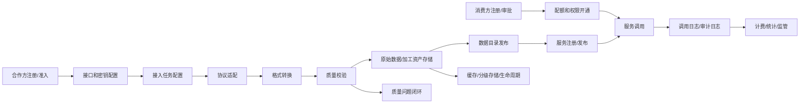

# 外部数据采集平台需求详设文档

> 来源：`附件三 1.外部数据采集平台软件招采需求说明书.docx`、`docs/technical-requirements.md`、`docs/requirements.md`、`tasks/requirement-analysis.md`、`tasks/claude-plan.md`。  
> 方法：按第一性原理从业务问题、输入输出、不可省略处理过程推导功能边界、模块关系、内部/外部接口和数据流。  
> 范围：九大功能模块、跨模块主链路、外部系统关系、内部服务关系、数据对象关系、验收口径。

## 1. 第一性原理推导

### 1.1 根问题

金融机构外部数据不是单一接口接入问题，而是外部数据从采购、准入、接入、质量、服务、使用、计费、监管到销毁的全生命周期治理问题。若只做接口转发，会留下四类根本风险：

1. 数据来源不可控：合作方资质、协议、密钥、数据范围和退出无法统一管理。
2. 数据流入不可控：协议格式各异，字段映射不统一，质量问题可能直接进入业务系统。
3. 数据使用不可控：消费方、权限、配额、调用日志和费用缺少统一口径。
4. 合规证据不可控：监管检查需要完整链路证据，不能依赖人工拼凑。

因此平台本质是“外部数据治理管道”，而不是“接口管理工具”。

### 1.2 最小可行闭环

平台必须形成如下闭环，任意一个环节缺失都会导致治理断点：

```text
合作方准入
  -> 接口/密钥/协议配置
  -> 接入任务配置
  -> 协议适配和格式转换
  -> 质量校验
  -> 原始数据和加工资产存储
  -> 数据目录发布
  -> 服务注册发布
  -> 消费方申请和授权
  -> 服务调用和配额控制
  -> 调用日志、审计日志、计费统计
  -> 监管报表、质量报告、生命周期处置
```

### 1.3 不可省略的处理过程

| 过程 | 不可省略原因 | 主要模块 |
|---|---|---|
| 身份认证 | 必须知道操作者或调用方是谁 | auth、gateway |
| 权限校验 | 金融数据访问必须按角色、系统、数据范围控制 | auth、gateway、partner、pipeline |
| 合作方准入 | 数据来源必须合法合规 | partner |
| 协议适配 | 外部数据入口天然多协议 | pipeline.ingest |
| 格式转换 | JSON/XML/CSV/Excel 必须转成统一内部模型 | pipeline.ingest |
| 质量校验 | 脏数据不能直接进入业务链路 | quality、pipeline |
| 存储与缓存 | 原始数据、加工数据、服务结果均需可追溯或可复用 | pipeline.storage |
| 服务封装 | 内部业务系统不应直接耦合合作方接口 | pipeline.service |
| 消费方治理 | 数据使用者必须可识别、可授权、可限额 | partner.consumer |
| 日志审计 | 合规检查和问题追踪必须有证据链 | common.audit、billing.stats |
| 计费统计 | 费用核算依赖统一调用量和数据量口径 | billing |
| 生命周期 | 数据留存、归档、销毁是合规要求 | pipeline.storage |

## 2. 总体业务架构

### 2.1 模块划分

| 模块 | 业务职责 | 关键对象 | 依赖模块 |
|---|---|---|---|
| 合作方管理 | 外部数据来源准入、接口配置、服务质量监控 | Partner、PartnerInterface、PartnerEvent | auth、audit、quality |
| 外部数据接入 | 多协议、多格式、同步策略、接入任务流转 | IngestTask、RawDataRecord、ProtocolAdapter | partner、quality、storage |
| 外部数据服务 | 服务注册、定义、发布、调用、限流熔断、日志 | DataService、InvokeLog、ApiCredential | consumer、catalog、billing |
| 数据目录与预览 | 数据资产可发现、元数据、预览、申请审批 | DataCatalog、CatalogApplication | partner、quality、service |
| 消费方管理 | 消费方准入、授权、配额、审计、反馈 | Consumer、ConsumerQuota、ConsumerEvent | auth、service、billing |
| 缓存存储复用 | 缓存、分级存储、加工、集市、生命周期 | DataAsset、StoragePolicy、LifecycleRecord | ingest、quality、catalog |
| 计费管理 | 计费规则、账单、核对、异议、对接财务 | BillingRule、Bill、StatsSnapshot | service log、consumer、partner |
| 统计监管 | 全链路指标、监管报表、报送、审计追溯、大屏 | StatsSnapshot、AuditLog、RegReport | all modules |
| 数据质量 | 六维规则、自动校验、问题闭环、报告、评分 | QualityRule、CheckResult、Issue、Score | ingest、service、storage |

### 2.2 端到端主链路



### 2.3 内外部参与方

| 参与方 | 类型 | 输入 | 输出 | 交互方式 |
|---|---|---|---|---|
| 外部合作方 | 外部 | 数据接口、文件、消息、数据库、资质材料、协议 | 数据响应、文件、消息流 | HTTP、WebService、SFTP/FTP、Kafka、MQ、DB、API Gateway |
| 平台管理员 | 内部 | 准入审批、规则配置、服务配置、权限配置 | 管理台页面、审批结果、告警 | Web Console |
| 数据消费方/业务系统 | 内部 | 数据使用申请、服务调用请求、反馈 | 服务响应、授权结果、调用凭证 | Open API、Console |
| 统一认证/IAM/SSO | 外部/内部 | 账号、组织、角色、认证结果 | token、身份信息 | OAuth2/OIDC/SAML/LDAP，待规范 |
| 财务/采购系统 | 外部/内部 | 账单、结算单、采购合同信息 | 同步回执、流程状态 | API/文件，待规范 |
| 监管报送系统 | 外部 | 监管报表、加密报文 | 报送回执、校验结果 | API/专线/文件，待规范 |
| 运维监控系统 | 内部 | JVM、服务、接口、数据库、中间件指标 | 告警、趋势、巡检报告 | Prometheus/日志/接口 |

## 3. 模块关联关系

### 3.1 核心依赖矩阵

| 源模块 | 目标模块 | 关系说明 | 关键数据 |
|---|---|---|---|
| partner | pipeline.ingest | 接入任务必须绑定已准入合作方和接口配置 | partner_id、interface_id、protocol、endpoint |
| pipeline.ingest | quality | 接入数据入库前触发质量校验 | batch_no、payload、rule_id、result |
| pipeline.ingest | storage | 原始数据进入热/温/冷和加工链路 | raw_data、batch_no、asset_code |
| storage | catalog | 加工后的资产形成目录条目 | asset_code、metadata、tags |
| catalog | pipeline.service | 目录申请审批后开通服务使用权限 | catalog_id、service_code、consumer_code |
| consumer | pipeline.service | 服务调用校验消费方身份、配额和权限 | consumer_code、api_key、quota |
| pipeline.service | billing | 调用日志是计费和统计的事实源 | service_code、consumer_code、elapsed、response_size |
| all modules | audit/stats | 所有关键操作进入审计追溯和统计聚合 | trace_id、actor、target、action |
| quality | partner/catalog/service | 质量评分影响合作方评级、目录展示和服务可用性 | score、rating、issue_status |

### 3.2 数据事实源

| 业务事实 | 事实源表/对象 | 下游使用 |
|---|---|---|
| 合作方身份和状态 | t_partner | 接入任务、目录、质量报告、结算 |
| 合作方接口配置 | t_partner_interface | 协议适配、密钥解密、频率限制 |
| 原始数据批次 | t_raw_data | 质量校验、加工、目录预览 |
| 数据服务发布状态 | t_data_service | API 调用、目录授权、计费 |
| 服务调用事实 | t_service_invoke_log | 计费、统计、审计、性能分析 |
| 消费方身份和状态 | t_consumer | 授权、配额、审计、费用 |
| 数据目录元信息 | t_data_catalog | 检索、预览、申请、推荐 |
| 质量规则和结果 | t_quality_rule、t_quality_check_result | 拦截、评分、报告、告警 |
| 账单事实 | t_bill | 财务核对、费用统计 |
| 审计事实 | t_audit_log | 合规追溯、监管检查 |

## 4. 功能点详细拆解

### 4.1 合作方管理

#### FR-101 合作方全生命周期

| 项 | 设计 |
|---|---|
| 目标 | 将外部数据来源纳入统一准入、审批、评级、退出治理 |
| 输入 | 合作方编码、名称、行业、数据类型、合规等级、资质材料、协议资料 |
| 状态 | REGISTERED -> SUBMITTED -> APPROVED -> ADMITTED -> RATED -> TERMINATED；驳回进入 REJECTED |
| 处理 | 注册生成档案；提交进入资质审核；审批通过后准入；服务运行后按质量和稳定性评级；注销或违规退出 |
| 输出 | 合作方档案、状态事件、评级记录、审计日志 |
| 异常 | 重复编码、资料缺失、非法状态流转、准入驳回、注销后禁止接入 |
| 关联 | 接入任务必须引用 ADMITTED 合作方；质量评分反向影响评级 |

#### FR-102 合作方分类分级

| 维度 | 示例 | 用途 |
|---|---|---|
| 数据类型 | 征信、司法、工商、运营商、互联网公开 | 目录分类、采购分析 |
| 行业属性 | 政务、金融、运营商、互联网、垂直行业 | 风险评估、准入策略 |
| 合规等级 | P1/P2/P3/P4 或公开/内部/敏感/重要 | 权限、脱敏、审批强度 |
| 服务质量 | A/B/C/D | 监控告警、合作方评级 |

#### FR-103 接口配置、密钥、权限管控

| 项 | 设计 |
|---|---|
| 输入 | protocol、endpoint、data_scope、rate_limit、credential |
| 安全处理 | credential 使用 SM4 或 KMS 加密后存储，只在调用时解密到内存 |
| 权限管控 | 接口级数据范围、调用频次、可接入任务范围 |
| 输出 | 接口配置、密钥密文、接口审计事件 |
| 异常 | endpoint 不合法、协议不支持、密钥为空、频率配置冲突 |

#### FR-104 合作方服务质量监控

| 指标 | 计算口径 | 下游影响 |
|---|---|---|
| 可用性 | 成功健康检查次数 / 总检查次数 | 告警、暂停接入 |
| 响应时长 | P50/P95/P99 接口耗时 | 路由策略、SLA 评价 |
| 数据准确率 | 质量校验通过率或抽样比对通过率 | 合作方评级 |
| 合规性 | 数据范围、授权、敏感字段违规次数 | 风险告警、退出 |

### 4.2 外部数据接入

#### FR-201 多类型外部数据接入

| 数据类型 | 典型字段 | 风险点 | 处理策略 |
|---|---|---|---|
| 政务数据 | 身份、税务、社保、公积金 | 权限和用途限制 | 强审批、审计、脱敏 |
| 征信数据 | 信用评分、逾期、负债 | 高敏个人信息 | 字段级权限、加密存储 |
| 工商司法 | 企业、法人、诉讼、执行 | 更新频率不一致 | 元数据记录更新时间 |
| 运营商 | 通信状态、实名、风险标签 | 个人信息合规 | 最小化采集 |
| 互联网公开 | 舆情、公开工商、公开新闻 | 准确性和时效性 | 来源标记、质量评分 |
| 行业垂直 | 场景化数据 | 标准不统一 | 映射模板和定制规则 |

#### FR-202 多协议多格式接入

| 协议 | 输入 | 适配职责 | 失败场景 |
|---|---|---|---|
| HTTP/HTTPS | URL、Header、Body、Auth | 发起请求、解析响应状态、超时重试 | 4xx/5xx、超时、证书错误 |
| WebService | WSDL、SOAP Action、XML | SOAP 请求封装和响应解析 | WSDL 不可达、命名空间错误 |
| SFTP/FTP | Host、Port、Path、Credential | 拉取/上传文件、断点续传 | 登录失败、文件缺失 |
| Kafka | Broker、Topic、Group | 消费消息、提交 offset | broker 不可用、积压 |
| MQ | Queue/Exchange、RoutingKey | 消费/确认消息 | ack 失败、死信 |
| DB 直连 | JDBC、SQL 白名单、账号 | 执行只读查询、分页抽取 | SQL 注入、慢查询 |
| API 网关 | 网关地址、路由、签名 | 统一网关调用 | 签名失败、限流 |

| 格式 | 转换职责 | 输出 |
|---|---|---|
| JSON | JSONPath/字段映射、类型转换 | Map/标准字段模型 |
| XML | XPath/节点映射、命名空间处理 | Map/标准字段模型 |
| CSV | 编码、分隔符、表头、流式读取 | 行记录集合 |
| Excel | Sheet、表头、单元格类型、流式读取 | 行记录集合 |

#### FR-203 标准与定制接入模式

| 模式 | 适用场景 | 配置内容 | 验收 |
|---|---|---|---|
| 标准接入 | 常见协议、固定模板数据 | 协议模板、字段模板、质量模板 | 开箱即用，无代码 |
| 定制接入 | 合作方差异大、字段复杂 | 字段映射、清洗规则、转换规则、质量规则 | 3 个工作日内完成 |

#### FR-204 接入全流程管控

```text
DRAFT 需求申请
  -> MAPPING 字段映射
  -> RULE_CONFIGURED 规则配置
  -> TESTING 测试验证
  -> PENDING_APPROVAL 上线审批
  -> ONLINE 上线运行
  -> OFFLINE 下线
```

关键控制点：

- 上线前必须测试通过。
- 协议、格式、字段映射、质量规则必须完整。
- 下线后保留历史数据和审计日志。
- 版本升级需保留旧版本配置以便回滚。

#### FR-205 同步模式

| 模式 | 触发方式 | 状态保存 | 适用场景 |
|---|---|---|---|
| 全量同步 | 手动/定时 | batch_no | 首次接入、周期全量 |
| 增量同步 | 定时/事件 | offset、timestamp、hash | 日常增量 |
| 实时推送 | 外部消息触发 | message offset | Kafka/MQ/API 推送 |
| 定时拉取 | Cron | last_success_at | 固定周期接口 |
| 断点续传 | 失败恢复 | file offset、row number | 大文件、大批量 |

### 4.3 外部数据服务

#### FR-301 标准服务和定制接口

| 类型 | 输入 | 处理 | 输出 |
|---|---|---|---|
| 标准服务 | 标准参数、服务编码 | 路由到标准数据资产或缓存 | 标准 JSON 响应 |
| 定制接口 | 自定义参数、转换规则 | 参数校验、定制查询/聚合/脱敏 | 定制 JSON/XML 响应 |

#### FR-302 服务全生命周期

```text
REGISTERED -> DEFINED -> TESTED -> PUBLISHED -> VERSIONED -> OFFLINE/ARCHIVED
```

服务发布前置条件：

- 绑定数据目录或数据资产。
- 定义输入输出参数。
- 配置鉴权方式、限流、熔断、超时。
- 测试通过。
- 审批通过。

#### FR-303 高可用能力

| 能力 | 设计 | 指标 |
|---|---|---|
| 路由 | 按 service_code/route_key 路由 | 路由命中率 |
| 负载均衡 | 多实例轮询/权重 | 单实例不过载 |
| 限流 | 按服务、消费方、IP、API Key | 超额返回 429 |
| 熔断 | 错误率/慢调用触发 | 降级响应 |
| 超时重试 | 幂等请求可重试 | 避免放大故障 |

#### FR-304 服务权限管控

权限由三层组成：

1. 管理台权限：用户是否能维护服务。
2. 服务调用权限：消费方是否被授权调用某服务。
3. 数据权限：调用后可见字段、样本范围、脱敏规则。

#### FR-305 调用日志

每次服务调用记录：

- trace_id、service_code、consumer_code、api_key、status_code。
- request_hash、response_size、elapsed_millis、error_code。
- log_day、created_at。
- 脱敏后的必要请求摘要，禁止写入明文敏感字段。

### 4.4 数据目录访问与预览

#### FR-401 统一数据目录

目录是“可发现的数据资产入口”，不是原始数据仓库。目录条目来自接入配置、加工资产、质量结果和合规标注。

分类维度：

- 数据主题：客户、企业、风险、营销、合规。
- 合作方：来源机构。
- 数据类型：JSON、文件、消息、表。
- 业务场景：风控、营销、运营、监管。
- 合规等级：公开、内部、敏感、重要。

#### FR-402 元信息管理

| 元信息 | 用途 |
|---|---|
| 字段定义 | 预览、服务参数、脱敏规则 |
| 数据格式 | 格式转换和服务输出 |
| 更新频率 | SLA、目录展示 |
| 数据来源 | 溯源、监管报表 |
| 合规说明 | 使用限制、授权依据 |
| 使用限制 | 权限、审批、过期控制 |

#### FR-403 数据预览

预览控制原则：

- 仅授权用户可预览。
- 默认返回样本，不返回全量。
- 敏感字段动态脱敏。
- 预览行为写审计。
- 展示质量报告摘要。

#### FR-404 检索与推荐

| 能力 | 设计 |
|---|---|
| 关键词检索 | name、subject、source、field_definitions、tags |
| 标签检索 | 主题、场景、合规等级、合作方 |
| 规则推荐 | 业务场景 + 标签 + 历史申请热度 |
| AI 推荐 | 待增强，不作为当前硬依赖 |

#### FR-405 数据申请

```text
申请 -> 审批 -> 绑定消费方 -> 开通服务/API Key -> 通知申请人 -> 审计留痕
```

### 4.5 数据消费方管理

#### FR-501 消费方全生命周期

```text
REGISTERED -> SUBMITTED -> APPROVED -> QUOTA_CONFIGURED -> ACTIVE -> SUSPENDED/TERMINATED
```

消费方必须绑定业务条线、系统类型、联系人、合规等级和授权范围。

#### FR-502 分类分级

| 维度 | 用途 |
|---|---|
| 业务条线 | 成本归集、权限边界 |
| 系统类型 | 核心、风控、营销、报表、测试 |
| 合规等级 | 是否允许访问敏感数据 |
| 使用规模 | 配额和限流初始值 |

#### FR-503 配额管理

配额类型：

- 请求次数配额。
- 数据量配额。
- 服务范围配额。
- 时间窗口配额。

控制方式：

- Redis 原子计数。
- 预警阈值。
- 超额拦截。
- 超额事件审计。

#### FR-504 行为审计

审计范围：

- 服务调用。
- 数据预览。
- 数据申请。
- 权限变更。
- 批量导出。
- 异常失败和越权尝试。

#### FR-505 服务质量反馈

反馈内容包括数据准确性、及时性、稳定性、响应速度、业务适配度。反馈进入服务评分和合作方评级。

### 4.6 数据缓存和存储再利用

#### FR-601 多维缓存

| 缓存类型 | Key 设计 | 失效策略 |
|---|---|---|
| 接口结果缓存 | service_code + request_hash | TTL、数据更新主动失效 |
| 热点数据缓存 | asset_code + field/query | LFU/LRU、访问热度 |
| 全量数据缓存 | batch_no/asset_code | 周期刷新、版本切换 |

#### FR-602 分级存储

| 层级 | 存储介质 | 数据特征 | 访问策略 |
|---|---|---|---|
| 热 | Redis/OceanBase 热表 | 高频调用、近期数据 | 低延迟 |
| 温 | OceanBase/达梦 | 中频访问、结构化数据 | 标准查询 |
| 冷 | MinIO/归档文件 | 低频、历史、合规留存 | 异步恢复 |

#### FR-603 脱敏与加密

| 场景 | 控制 |
|---|---|
| 存储 | 敏感字段 SM4 加密或列级加密 |
| 传输 | TLS 1.2+ |
| 预览 | 动态脱敏 |
| 导出 | 审批 + 脱敏 + 水印 + 审计 |
| 日志 | 禁止明文敏感字段 |

#### FR-604 数据加工复用

加工步骤：

1. 清洗：空值、非法格式、异常值。
2. 标准化：字段命名、枚举、单位、编码。
3. 关联整合：按业务键合并多来源数据。
4. 标签加工：场景标签、风险标签、质量标签。
5. 资产沉淀：写入 DataAsset 和 Marketplace。

#### FR-605 外部数据集市

集市提供可复用资产，不直接暴露原始数据。资产必须有来源、口径、质量、合规、生命周期说明。

#### FR-606 生命周期管理

生命周期动作：

- 留存。
- 归档。
- 恢复。
- 销毁。
- 销毁证明留痕。

### 4.7 计费管理

#### FR-701 计费模型

| 模型 | 计费因子 |
|---|---|
| 按调用次数 | 调用成功次数 |
| 按数据量 | response_size、record_count |
| 按接口 | service_code 固定价格 |
| 按套餐 | 阶梯、包月、包量 |
| 按时长 | 服务开通时长 |

#### FR-702 规则配置

规则匹配顺序建议：

1. consumer + service 精确规则。
2. partner + service 规则。
3. service 默认规则。
4. 全局默认规则。

#### FR-703 账单生成核对

```text
调用日志聚合 -> 匹配计费规则 -> 生成账单 -> 核对 -> 确认/异议 -> 调整 -> 结算
```

#### FR-704 费用统计

统计维度：

- 合作方。
- 消费方。
- 服务。
- 时间。
- 计费模型。
- 业务条线。

#### FR-705 财务采购对接

当前接口规范待外部提供。平台侧应保留适配器：

- BillExportAdapter。
- FinanceSyncAdapter。
- PurchaseContractAdapter。

### 4.8 统计监管

#### FR-801 全链路统计

指标包括：

- 接入量。
- 调用量。
- 传输量。
- 缓存命中率。
- 成功率。
- 响应时间。
- 质量通过率。
- 费用金额。

#### FR-802 监管报表

报表类型：

- 外部数据来源统计。
- 个人信息使用报表。
- 合规审批报表。
- 数据共享复用报表。
- 质量问题处置报表。

#### FR-803 监管报送

由于监管标准待明确，当前设计为框架：

```text
报表数据准备 -> 口径校验 -> 脱敏/加密 -> 生成报文 -> 报送 -> 回执处理 -> 审计
```

#### FR-804 合规审计追溯

审计查询应支持按 trace_id 串起：

合作方 -> 接入任务 -> 原始数据批次 -> 质量校验 -> 数据资产 -> 服务调用 -> 消费方 -> 账单/报表。

#### FR-805 可视化大屏

大屏展示：

- 平台运行状态。
- 接入和服务趋势。
- 质量评分。
- 合规风险。
- 费用趋势。
- 告警事件。

### 4.9 数据质量管理

#### FR-901 全链路质量监控

质量监控覆盖：

- 接入前：合作方接口健康和数据协议校验。
- 接入中：格式、字段、批次、重复性校验。
- 加工中：清洗和标准化质量。
- 存储后：资产完整性和生命周期。
- 服务输出：响应字段和脱敏合规。

#### FR-902 六维质量规则

| 维度 | 示例规则 |
|---|---|
| 完整性 | 必填字段不能为空 |
| 准确性 | 身份证、手机号、统一社会信用代码格式正确 |
| 一致性 | 同一主体多来源字段不冲突 |
| 及时性 | 数据更新时间不超过 SLA |
| 有效性 | 枚举值、范围、业务规则合法 |
| 唯一性 | 主键、业务键、批次内无重复 |

#### FR-903 自动校验

校验触发点：

- 接入任务测试。
- 接入任务正式执行。
- ETL 加工后。
- 服务输出前抽样。
- 定时巡检。

#### FR-904 问题闭环

```text
OPEN -> ASSIGNED -> FIXING -> VERIFYING -> CLOSED
```

超时未处理进入告警；严重问题可暂停接入或服务。

#### FR-905 质量报告

报告维度：

- 合作方。
- 数据类型。
- 服务。
- 批次。
- 时间周期。
- 质量维度。

#### FR-906 评分评级

建议评分：

```text
score = Σ(维度得分 * 权重)
评级：A >= 90，B >= 80，C >= 60，D < 60
```

质量评级影响合作方评级、目录展示排序和服务可用性。

## 5. 接口设计

### 5.1 外部接口

| 接口类别 | 提供方 | 调用方 | 认证 | 主要数据 |
|---|---|---|---|---|
| 合作方数据 API | 外部合作方 | platform-pipeline | 合作方密钥/证书/API Key | 原始数据 |
| 文件交换 | 外部合作方 | platform-pipeline | SFTP/FTP 账号、密钥 | CSV/Excel/XML 文件 |
| 消息订阅 | 外部合作方 | platform-pipeline | Kafka/MQ 账号 | 实时数据 |
| 数据服务 Open API | platform-gateway/service | 内部业务系统 | API Key + 签名 + 时间戳 | 标准数据响应 |
| IAM/SSO | 统一认证系统 | platform-auth | OAuth2/OIDC/SAML | 用户身份、组织、角色 |
| 财务采购 | 财务/采购系统 | platform-billing | 待定 | 账单、结算单 |
| 监管报送 | 监管系统 | platform-billing/stats | 待定 | 加密报表、回执 |

### 5.2 内部服务 API

| 模块 | API | 用途 |
|---|---|---|
| auth | `/auth/login`、`/auth/refresh`、`/auth/permissions` | 登录、刷新、权限获取 |
| partner | `/api/v1/partners`、`/api/v1/partners/{id}/events` | 合作方档案和状态流转 |
| consumer | `/api/v1/consumers`、`/api/v1/consumers/{id}/quota` | 消费方和配额 |
| ingest | `/api/v1/ingest/tasks`、`/api/v1/ingest/tasks/{id}/test` | 接入任务和测试 |
| service | `/api/v1/services`、`/api/v1/services/{code}/invoke` | 服务管理和调用 |
| catalog | `/api/v1/catalog`、`/api/v1/catalog/{id}/apply` | 目录、预览、申请 |
| quality | `/api/v1/quality/rules`、`/api/v1/quality/checks` | 规则和校验 |
| billing | `/api/v1/billing/rules`、`/api/v1/billing/bills/generate` | 计费规则和账单 |
| stats | `/api/v1/stats/dashboard`、`/api/v1/stats/audit` | 统计和审计 |

### 5.3 消息事件

| 事件 | 生产者 | 消费者 | 用途 |
|---|---|---|---|
| PartnerStatusChanged | partner | audit、stats | 合作方状态审计 |
| IngestTaskCompleted | ingest | quality、storage、stats | 触发质量和加工 |
| QualityIssueCreated | quality | notification、partner | 告警和评级 |
| ServiceInvoked | service | billing、stats、audit | 计费和审计 |
| ConsumerQuotaExceeded | consumer/service | audit、notification | 超额告警 |
| BillGenerated | billing | finance adapter、audit | 财务同步 |
| LifecycleActionCompleted | storage | audit、stats | 归档销毁证据 |

## 6. 数据流设计

### 6.1 数据接入流

```text
合作方源数据
  -> ProtocolAdapter 拉取/接收
  -> FormatConverter 转换
  -> 字段映射和规则处理
  -> QualityExecutor 校验
  -> t_raw_data
  -> ETL Pipeline
  -> t_data_asset/t_marketplace_data
  -> t_data_catalog
```

### 6.2 服务调用流

```text
消费方请求
  -> Gateway 初步鉴权/限流
  -> API Key + 签名 + 时间戳防重放
  -> 消费方状态和配额校验
  -> 服务状态校验
  -> 缓存查询或资产查询
  -> 动态脱敏
  -> 返回响应
  -> 写服务调用日志
  -> 触发计费和统计
```

### 6.3 合规审计流

```text
用户/系统操作
  -> 生成 trace_id
  -> 写 t_audit_log
  -> 关联业务对象
  -> 统计监管查询
  -> 导出监管证据
```

## 7. 权限与安全详设

### 7.1 身份模型

| 身份 | 认证方式 | 权限来源 |
|---|---|---|
| 平台管理员 | 用户名密码、MFA、SSO | RBAC 权限码 |
| 合作方管理员 | 账号、证书、API Key | 合作方范围 |
| 消费方系统 | API Key、签名、时间戳 | 服务授权和配额 |
| 运维人员 | SSO/MFA | 运维权限 |
| 审计人员 | SSO/MFA | 只读审计权限 |

### 7.2 权限码分层

| 层 | 示例 |
|---|---|
| 模块查看 | partner:view、ingest:view、stats:view |
| 创建修改 | partner:create、service:update、quality:create |
| 审批执行 | partner:approve、ingest:approve、billing:run |
| 系统管理 | system:view、system:create、system:update |

### 7.3 数据安全控制

| 控制点 | 设计 |
|---|---|
| 密钥 | 加密存储、定期轮换、最小可见 |
| 敏感字段 | 自动识别、静态加密、动态脱敏 |
| 接口调用 | 签名验签、时间戳、防重放、限流 |
| 日志 | 脱敏、追加写、保留期 >= 3 年 |
| 数据销毁 | 审批、执行、证明、审计 |

## 8. 非功能详设

| 类型 | 设计策略 |
|---|---|
| 性能 | 缓存、异步日志、批处理、索引、分区、连接池、水平扩展 |
| 可用性 | 微服务隔离、熔断、限流、重试、同城双活、滚动升级 |
| 扩展性 | 适配器接口、策略模式、配置化规则、插件扩展 |
| 兼容性 | 标准 SQL 优先、达梦/OceanBase 方言隔离、容器化部署 |
| 可维护性 | 统一日志、全链路 trace、指标监控、告警阈值 |
| 易用性 | 模块化控制台、批量导入导出、可视化配置、错误提示 |
| 合规性 | 数据全生命周期审计、报表、加密脱敏、权限最小化 |

## 9. 验收映射

| 验收项 | 证据 |
|---|---|
| 46 条 FR 覆盖 | Controller/API、前端页面、测试用例、端到端链路 |
| 权限生效 | 401/403 测试、权限码矩阵、审计日志 |
| 接入能力 | 各协议适配测试、各格式转换测试 |
| 质量能力 | 六维规则测试、质量报告、问题闭环 |
| 计费统计 | 调用日志、账单生成、统计快照 |
| 合规审计 | t_audit_log、trace_id、监管报表 |
| 性能 | JMeter 报告、缓存命中率、慢 SQL 分析 |
| 可用性 | 48h 稳定性、故障演练、双活切换 |

## 10. 待确认与风险

| 编号 | 问题 | 影响 |
|---|---|---|
| Q-05 | 监管报送标准未明确 | 报文格式、加密规范、回执处理 |
| Q-06 | 财务/采购接口未明确 | 账单同步字段和状态机 |
| Q-11 | 实际业务规模缺失 | 分区、容量、性能压测口径 |
| R-01 | 合作方准确率口径需业务确认 | 评级和质量报告 |
| R-02 | 字段级 ABAC 需组织/数据分级字典 | 权限模型完整性 |
| R-03 | 国产数据库方言差异 | 迁移脚本和索引策略 |

